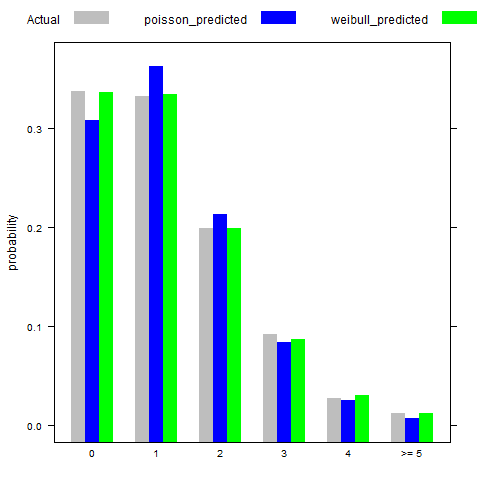

The main motivation to develop the `Countr` by the authors was to create an
alternative to the Poisson model to fit the number of goals scored by a team in
a football match. Despite its clear limitations, the Poisson model was
systematically used in the literature perhaps due to its simplicity. We briefly
explain in this document why the renewal-count models should be preferred for
football data. We hope that the development of the `Countr` package will
encourage more data analyst to use renewal-count models, especially when
investigating sports data.

Before starting our analysis, we need to load the useful packages. On top of
`Countr`, the `dplyr` package \citep{dplyr2016} will be used:

    library(Countr)
    library(dplyr)

# Motivation

As discussed in length in \citet[Chapter 4]{TarakPhd} or more briefly in
\citet{boshnakov2017bivariate}, the main issue with the Poisson model when
modelling the goals scored by a team in football is that the hazard function
(the instant probability of scoring) remains constant for every time unit
(minutes say in football). However, empirical studies showed that this is rather
questionable as goals are more likely to be scored at the end of each half
because of players tiredness, &#x2026; see for example
\citet[Figure~1]{dixon1998birth}. 

This flexibility is allowed by renewal-count model when selecting  the
appropriate interval-arrival times density. One strategy to select this density
is discussed in \citet[Chapter 4]{TarakPhd} and is beyond the scope of this
document. Here we simply say that the weibull density seemed to provide the best
fit and will be used in the rest of this study.

# Comparing the Poisson and weibull models

Our aim here is not to conduct an extensive analysis of the data but simply to
highlight the improvement introduced by the weibull-count model compared to
Poisson. For an example with extensive analysis, see the *fertility* data
example.

## Data

The *football* dataset is shipped with the `Countr` package and can be loaded
in the usual way by a call to the `data()` function:

    data(football)
    table(football$awayTeamGoals)

The data contains the final scores of the 1104 matches (380 matches per season)
played in English Premier League from seasons 2009/2010 to season 2016/2017. The
game data and home and away team names are also provided. We focus in this study
on the goals scored by the away team.

The Poisson model can be fitted in a standard way by a call to `glm()` with the
family argument set to `poisson`. The weibull-count-model is fitted by a call to
`renewalCount()` with `dist = "weibull"`. The model considered here is intercept
only (no covariates specified).

    away_poiss <- glm(formula = awayTeamGoals ~ 1, family = poisson, data = football)
    away_wei <- renewalCount(formula = awayTeamGoals ~ 1, data = football,
                             dist = "weibull", weiMethod = "conv_dePril",
                             computeHessian = FALSE, 
                             control = renewal.control(trace = 0,
                                                       method = "nlminb")
                             )

## Visual inspection

We start by investigating the distribution of goals and the associated fitted
probabilities induced by both models. The away team rarely scores more than 4
goals and hence we decided to aggregate counts of 5 and larger. This can be done
in the usual way by specifying the `break` argument.

    breaks_ <- 0:5
    pears <- compareToGLM(poisson_model = away_poiss,
                          breaks = breaks_, weibull = away_wei)

    frequency_plot(pears$Counts, pears$Actual,
                   dplyr::select(pears, contains("_predicted")),
                   colours = c("grey", "blue", "green", "black")
                   )

As expected, the most likely outcome for away goals is 0, 1 and to some
extent 2. Eyeballing, the weibull-count model is a clear improvement 
over the Poisson model. Even of the other count values, it seems that the
weibull-count model still slightly outperforms the Poisson alternative. These
findings will be confirmed formally in the next sections by running formal
statistical tests.

## Likelihood ratio test

The Poisson model is a special case of the weibull-count with shape parameter
set to 1. Therefore, the two models are nested and the likelihood ratio can be
used to discriminate between them as explained in \citet[Chapter 6]{cameron2013regression}:

    library(lmtest)
    lr <- lrtest(away_poiss, away_wei)
    print(lr)

    Loading required package: zoo
    
    Attaching package: ‘zoo’
    
    The following objects are masked from ‘package:base’:
    
        as.Date, as.Date.numeric
    Warning message:
    In modelUpdate(objects[[i - 1]], objects[[i]]) :
      original model was of class "glm", updated model is of class "renewal"
    Likelihood ratio test
    
    Model 1: awayTeamGoals ~ 1
    Model 2: awayTeamGoals ~ 1
      #Df LogLik Df Chisq Pr(>Chisq)    
    1   1  -4364                        
    2   2  -4350  1  28.5    9.4e-08 ***
    ---
    Signif. codes:  0 ‘***’ 0.001 ‘**’ 0.01 ‘*’ 0.05 ‘.’ 0.1 ‘ ’ 1

The likelihood ratio test null hypothesis (both model present equal fits) is
rejected at any convenience level and confirms that the Weibull addition
induced by the shape parameter does improve the fitting.

## Chi-square goodness-of-fit test

Finally, a formal chi-square goodness-of-fit test has been described in in
\citet[Section 5.3.4]{cameron2013regression} and implemented in 
`Countr::chiSq_gof()`. It can be used to judge how well the weibull model
describes the data:

    gof_wei <- chiSq_gof(away_wei, breaks = breaks_)
    gof_pois <- chiSq_gof(away_poiss, breaks = breaks_)
    print(gof_wei)

    chi-square goodness-of-fit test
    
    Cells considered 0 1 2 3 4 >= 5
      DF Chisq Pr(>Chisq)
    1  5  7.15       0.21

The test concludes that the null hypothesis cannot be rejected (and hence that
the weibull-count model describes the data well). Note that the same statistic
computed for the Poisson model yields a value `formatC(gof_pois[, 2])` compared to \(\chi^2(5)\) critical value of
\(9.24\) at 5%. The Poisson model is hence strongly rejected.

# Save Image     :ignoreheading:

We conclude this analysis by saving the work space to avoid re-running the
computation in future exportation of the document:

    save.image()

# Bibliography     :ignoreheading:

\bibliographystyle{apalike}
\bibliography{REFERENCES}

